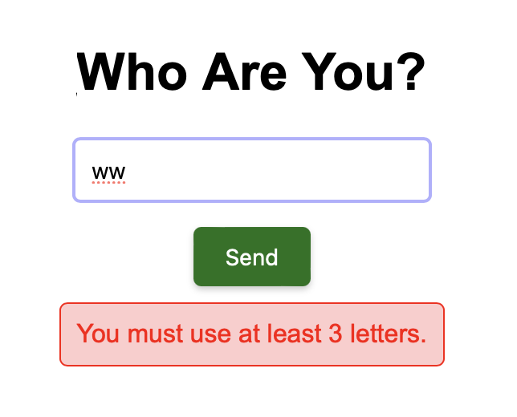

# Country Flags Quiz

## Project Purpose

This project is a simple web-based quiz game that tests users' knowledge of country flags. It's built using HTML, CSS, and JavaScript and aims to provide an enjoyable and educational experience. Users are shown flag images and must select the correct country from four options within a 15-second time limit. After completing the quiz, a leaderboard displays the top scores.

## Live Demo

You can see the live version of this project here: [Live Demo](https://cerenyildiran.github.io/CountryFlagQuiz/)

## Technologies Used

- HTML
- CSS
- JavaScript

## Usage

1. Open the project in your browser.

2. Enter your nickname in the input field.
3. Click the "Send" button or press Enter to start the quiz.

4.If you use a nickname with fewer than 3 characters or symbols instead of letters, you will receive a warning.


5. Answer the questions within the 15-second countdown. If a question is not answered within 15 seconds, it will be considered incorrect, and the next question will be asked.

6. At the end of the quiz, your score will be displayed.


## How to Clone This Project from GitHub

If you'd like to clone this project and run it on your local machine, follow these steps:

### 1. Clone the Repository

First, you need to clone the repository to your local machine. To do this:

- Open your terminal (MacOS/Linux) or Command Prompt (Windows).
- Run the following command:

  ```bash
  git clone https://github.com/cerenyildiran/CountryFlagQuiz.git

After the repository has been cloned, navigate to the project directory using the following command:

```bash
cd CountryFlagQuiz
```
This command will change your working directory to the project's root folder.

## Validation
- The HTML code in this project has passed the [W3C Validator](https://validator.w3.org/) with no errors, ensuring compliance with web standards.
  
- The JavaScript code has no errors but does include a few warnings. However, these warnings do not affect the proper functioning of the code and can be safely ignored.
  
  


